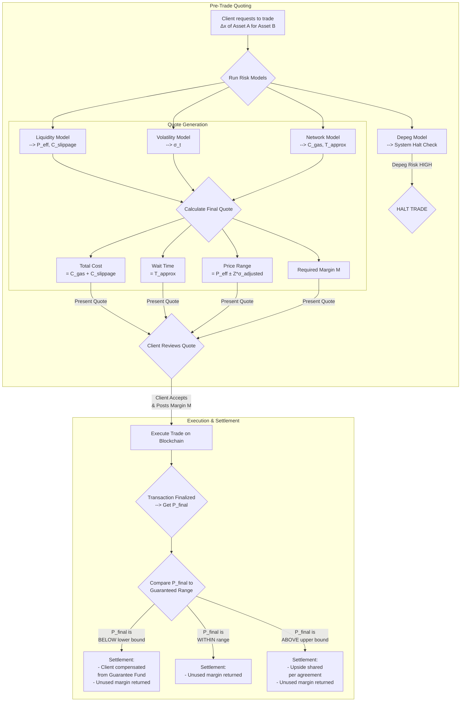

# 2. Short-term Risk Model
### 2.0 Settings

* Coin: USDC
* Chain: ETH - SOL Cross chain
* Bridge: Wormhole
### 2.1 Proposed models overview
#### 2.1.1 Liquidity Risk Model

* **Objective:** To estimate the direct, immediate cost of a trade (slippage) caused by its size relative to the available liquidity in a pool.
* **Methodology Overview:** This model is based on the standard Automated Market Maker (AMM) constant product formula (`x * y = k`). It calculates the expected "price impact" by simulating how a specific trade amount (e.g., selling 1,000,000 USDT) will alter the ratio of assets in the liquidity pool, thereby changing the price. It isolates the impact of this single trade.
* **Key Metrics:**
    * **Slippage:** The percentage difference between the expected trade price and the final execution price.
    * **Price Impact:** The change in the market price of the asset pair resulting from the trade.
* **Supplement**  
For current bridge, we estimate target pool(e.g. USDCet-USDC on solana)

---

#### 2.1.2 Price Volatility Model

* **Objective:** To quantify the general market risk and price uncertainty of an asset, independent of any single trade.
* **Methodology Overview:** This model uses a two-pronged approach:
    1.  **Historical Volatility:** It analyzes the standard deviation of an asset's price returns over a recent historical period. This method assumes that past volatility is a reasonable indicator of near-future volatility.
    2.  **GARCH(1,1) Prediction:** A more advanced statistical model that assumes volatility is not constant. It captures the tendency for volatility to occur in clusters (i.e., high-volatility periods are followed by more high volatility) and to eventually revert to a long-term average.
* **Key Metrics:**
    * **Historical Volatility $\sigma_{HV}$:** A backward-looking measure of price fluctuation.
    * **GARCH Prediction:** A forward-looking forecast of volatility.

---

#### 2.1.3 Depeg Risk Model

* **Objective:** To monitor the stability of a stablecoin and provide an early warning if it is losing its peg to its target value.
* **Methodology Overview:** The model relies on an external data source, an oracle, to get a reliable, real-time market price for the stablecoin. It then compares this price to the target peg. If the price deviates beyond a predefined tolerance or threshold (e.g., ±1%), it flags a potential depeg event.
* **Key Metrics:**
    * **Oracle Price:** The trusted, externally sourced market price of the stablecoin.
    * **Depeg Threshold (ϵ):** The maximum allowable deviation from the peg before a risk is flagged.

---

#### 2.1.4 Network-Level Risks Model

* **Objective:** To assess the current health and congestion of the blockchain network, which directly impacts transaction costs and settlement times.
* **Methodology Overview:** The model establishes a "normal" baseline for network activity by calculating a moving average of key indicators. It then compares the current, real-time values of these indicators to their historical baseline. A significant spike above the average indicates congestion.
* **Key Metrics:**
    * **Gas Fee:** The current cost of a transaction compared to its recent moving average.
    * **Mempool Size:** The number of pending (unconfirmed) transactions compared to its recent moving average.

### 2.2 Integrated total costs model
#### 2.2.1 Transaction cost
* **Slippage Cost ($C_{\text{slippage}}$)**: $$C_{\text{slippage}} = \Delta x\cdot(P_{\text{init}}-P_{\text{eff}})$$
    * $\Delta x$ = total trading volume
    * $P_{\text{init}}$ = spot price
    * $P_{\text{eff}}$ = average executed price ($\frac{y-\frac{k}{x + \Delta x}}{\Delta x}$)
* **Gas Cost ($C_{\text{gas}}$)**: $$C_{\text{gas}} = G\cdot \text{Gas}_{\text{limit}}$$
    * $G$: current gas fee level (stanard/fast, up to user's choice) 
    * $\text{Gas}_{\text{limit}}$: total gas units required for the amount of trading volume
* **Total Cost**:$$C_{\text{total}} =C_{\text{gas}}+C_{\text{slippage}}$$
#### 2.2.2 Approximate Transaction Time
* **base transaction time $T_{\text{base}}$**: Establish a base time for each gas level based on historical blockchain data
* **Mempool Congestion Ratio $r$**: a multiplier to adjust the base time based on mempool congestion level$$r=\frac{P_{\text{tx}}}{MA(P_{\text{tx}})}$$
    * P_{\text{tx}}: Pending Transactions in the mempool
* **Approximate Transaction Time $T_{\text{approx}}$**:$$T_{\text{approx}}=r\cdot T_{\text{base}}$$

#### 2.2.3 Final Executed Price Range
* **Mean (center of range)**: $$P_{\text{eff}}=\frac{y-\frac{k}{x + \Delta x}}{\Delta x}$$
* **Deviation**$$\sigma_{\text{adjusted}}=\sigma_t\cdot \sqrt{\frac{T_{\text{approx}}}{T_\sigma}}$$
    * $\sigma_t$: predicted volatility from GARCH(1,1)
    * $T_{\sigma}$: adjust volatility's time horizon to match $T_{\text{approx}}$
* **Price Range**: $$P_\text{range}=P_{\text{eff}}\pm Z\cdot \sigma_{\text{adjusted}}$$

#### 2.2.4 Summary
* **Wait Time**: $$T_{\text{approx}}$$
* **Total Cost**: $$C_{\text{total}} =C_{\text{gas}}+C_{\text{slippage}}$$
* Final executed price range: $$P_\text{range}=P_{\text{eff}}\pm Z\cdot \sigma_{\text{adjusted}}$$

### 2.3 Margin and Guaranteed Execution
#### 2.3.1 Margin
* **Required Margin $M$**$$M=\Delta x \cdot (Z\cdot  \sigma_{\text{adjusted}})$$
    * Z is matched to the Price range model
    * Margin is locked until the transaction is finalized
#### 2.3.2 Guaranteed execution and potential revenue model
* **Quote**: we quote client a firm **Price Range $P_\text{range}$**, and the final execution price is $P_\text{final}$
    * if $P_\text{final}$ is **within the range**: settle the transaction, remaining money is kept in margin account
    * if $P_\text{final}$ is **below the lower bound**: platform needs to compensate the client for shortfall
    * if $P_\text{final}$ is **above the upper bound**: platform keeps the positive slippage , it could be as additional margin to cover shortfall or as revenue
* Potential revenue model: base operational fee + % of upside capture

### Summary
